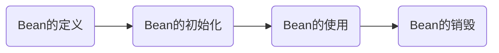

[TOC]

# Spring Bean^o^基本概念

## ^o^Spring Bean定义

==由Spring IOC容器管理的对象称为Bean，Bean根据Spring配置文件中的信息创建。==

可以把 Spring IoC 容器看作是一个大工厂，Bean 相当于工厂的产品，如果希望这个大工厂生产和管理 Bean，则需要告诉容器需要哪些 Bean，以及需要哪种方式装配 Bean。

## Spring Bean的作用域

| 作用域         | 含义                                                 | 备注                                                         |
| -------------- | ---------------------------------------------------- | ------------------------------------------------------------ |
| ==singleton==  | ==每个IoC容器中只有一个实例==                        | 默认值                                                       |
| ==prototype==  | ==可以有多个==                                       |                                                              |
| request        | 每次http请求创建一个                                 | 该作用域仅在基于 web 的 Spring ApplicationContext 情形下有效。 |
| session        | 在一个 HTTP Session 中，一个 bean 定义对应一个实例。 | 同上                                                         |
| global-session | 全局会话，所有会话共享一个实例。                     | 该作用域在当前 ServletContext 内有效。                       |

在 Spring 配置文件中，可以使用 <bean> 元素的 scope 属性来配置Bean的作用域。

### Spring Bean的线程安全问题

对于无状态Bean（只查询）是线程安全的，对于有状态Bean（可修改）是线程不安全的。

对于有状态的bean，使用ThreadLocal解决，官方提供了RequestContextHolder、TransactionSynchronizationManager等

## ^o^Spring Bean配置文件的配置方法

Spring配置文件支持两种格式，即XML格式和Properties文件格式：

- Properties 配置文件主要以 key-value 键值对的形式存在，只能赋值，不能进行其他操作，适用于简单的属性配置。
- XML更加灵活，但是内容繁琐，适用于大型复杂项目

==通常情况下，Spring的配置文件使用XML格式==。

XML 配置文件的根元素是 <beans>，该元素包含了多个子元素 <bean>。每一个 <bean> 元素都定义了一个 Bean，并描述了该 Bean 如何被装配到 Spring 容器中。

### XML配置示例

![XML格式配置Bean]

```xml
<?xml version="1.0" encoding="UTF-8"?>
<beans xmlns="http://www.springframework.org/schema/beans"
    xmlns:xsi="http://www.w3.org/2001/XMLSchema-instance"
    xsi:schemaLocation="http://www.springframework.org/schema/beans
   http://www.springframework.org/schema/beans/spring-beans-3.0.xsd">
    <bean id="helloWorld" class="net.biancheng.HelloWorld">
        <property name="message" value="Hello World!" />
    </bean>
</beans>
```

上述代码中，==使用 id 属性定义了 Bean，并使用 class 属性指定了 Bean 对应的类。==

### <bean> 元素常用属性

<bean> 元素中可以包含很多属性，其常用属性如下表所示。

![bean元素的常用属性]

| 属性名称        | 描述                                                         |
| --------------- | ------------------------------------------------------------ |
| id              | Bean 的唯一标识符，Spring 容器对 Bean 的配置和管理都通过该属性完成。id 的值必须以字母开始，可以使用字母、数字、下划线等符号。 |
| name            | name 属性中可以为 Bean 指定多个名称，每个名称之间用逗号或分号隔开。Spring 容器可以通过 name 属性配置和管理容器中的 Bean。 |
| class           | 该属性指定了 Bean 的具体实现类，它必须是一个完整的类名，即类的全限定名。 |
| scope           | 用于设定 Bean 实例的作用域，属性值可以为 singleton（单例）、prototype（原型）、request、session 和 global Session。其默认值是 singleton |
| constructor-arg | <bean>元素的子元素，可以使用此元素传入构造参数进行实例化。该元素的 index 属性指定构造参数的序号（从 0 开始），type 属性指定构造参数的类型 |
| property        | <bean>元素的子元素，用于调用 Bean 实例中的 setter 方法来属性赋值，从而完成依赖注入。该元素的 name 属性用于指定 Bean 实例中相应的属性名 |
| ref             | <property> 和 <constructor-arg> 等元素的子元索，该元素中的 bean 属性用于指定对某个 Bean 实例的引用 |
| value           | <property> 和 <constractor-arg> 等元素的子元素，用于直接指定一个常量值 |
| list            | 用于封装 List 或数组类型的依赖注入                           |
| set             | 用于封装 Set 类型的依赖注入                                  |
| map             | 用于封装 Map 类型的依赖注入                                  |
| entry           | <map> 元素的子元素，用于设置一个键值对。其 key 属性指定字符串类型的键值，ref 或 value 子元素指定其值 |
| init-method     | 容器加载 Bean 时调用该方法，类似于 Servlet 中的 init() 方法  |
| destroy-method  | 容器删除 Bean 时调用该方法，类似于 Servlet 中的 destroy() 方法。该方法只在 scope=singleton 时有效 |
| lazy-init       | 懒加载，值为 true，容器在首次请求时才会创建 Bean 实例；值为 false，容器在启动时创建 Bean 实例。该方法只在 scope=singleton 时有效 |

# Bean工厂

## BeanFactory和ApplicationContext

==Bean工厂（BeanFactory）==是Spring框架最核心的接口，使得管理不同类型的Java对象成为可能，==应用上下文（ApplicationContext）==建立在BeanFactory基础之上，提供了更多企业级功能。我们一般陈BeanFactory为IoC容器，而称ApplicationContext为Spring容器（应用上下文）。

|        | BeanFactory                                  | ApplicationContext                               |
| ------ | -------------------------------------------- | ------------------------------------------------ |
| 用途   | 是Spring框架的基础设施，面向Spring本身       | 面向开发者                                       |
| 初始化 | 初始化容器时，并未实例化Bean，直到第一次访问 | 初始化时就实例化所有单实例的Bean，初始化时间稍长 |
| 关系   | 父类                                         | 子类                                             |


# Spring Bean^o^生命周期



Spring 根据 Bean 的作用域来选择管理方式。分两种情况：

- 对于 singleton 作用域的 Bean，Spring 能够精确地知道该 Bean 何时被创建，何时初始化完成，以及何时被销毁；
- 而对于 prototype 作用域的 Bean，Spring 只负责创建，当容器创建了 Bean 的实例后，Bean 的实例就交给客户端代码管理，Spring 容器将不再跟踪其生命周期。

## Spring bean生命周期执行流程 


Bean生命周期的整个执行过程描述如下：

1. Spring启动，查找并加载需要被Spring管理的Bean，并实例化Bean
2. 利用依赖注入完成Bean中所有属性值的配置注入
3. 如果Bean实现了BeanNameAware接口，则Spring调用Bean的setBeanName()方法传入当前==Bean的id值==
4. 如果 Bean 实现了 BeanFactoryAware 接口，则 Spring 调用 setBeanFactory() 方法传入当前工==厂实例的引用==。
5. 如果 Bean 实现了 ApplicationContextAware 接口，则 Spring 调用 setApplicationContext() 方法传入当前 ==ApplicationContext 实例的引用==。
6. 如果 Bean 实现了 [BeanPostProcessor](#Spring Bean^o^后置处理器) 接口，则 Spring 调用该接口的预初始化方法 postProcessBeforeInitialzation() 对 Bean 进行加工操作，此处非常重要，==**Spring 的 AOP 就是利用它实现的。**==
7. 如果 Bean 实现了 InitializingBean 接口，则 Spring 将调用 afterPropertiesSet() 方法。
8. 如果在配置文件中通过 init-method 属性指定了初始化方法，则调用该初始化方法。
9. 如果 [BeanPostProcessor ](#Spring Bean^o^后置处理器)和 Bean 关联，则 Spring 将调用该接口的初始化方法 postProcessAfterInitialization()。==此时，Bean 已经可以被应用系统使用了==。
10. 如果在 <bean> 中指定了该 Bean 的作用域为 singleton，则将该 Bean 放入 Spring IoC 的缓存池中，触发 Spring 对该 Bean 的生命周期管理；如果在 <bean> 中指定了该 Bean 的作用域为 prototype，则将该 Bean 交给调用者，调用者管理该 Bean 的生命周期，Spring 不再管理该 Bean。
11. 如果 Bean 实现了 DisposableBean 接口，则 Spring 会调用 destory() 方法销毁 Bean；如果在配置文件中通过 destory-method 属性指定了 Bean 的销毁方法，则 Spring 将调用该方法对 Bean 进行销毁。

## 生命周期回调

了解Spring生命周期的意义就在于，可以利用Bean在其存活期间的指定时刻完成一些相关操作。==一般情况下，会在Bean被初始化和被销毁前执行一些操作。==

Spring 官方提供了 3 种方法实现初始化回调和销毁回调：

1. 实现 InitializingBean 和 DisposableBean 接口；
2. 在 XML 中配置 init-method 和 destory-method；
3. 使用 @PostConstruct 和 @PreDestory 注解。

在一个Bean中有多种生命周期回调方法时，优先级为：注解>接口>XML

`#注意#(red)`：不建议使用接口和注解，这会让pojo类和Spring框架紧耦合。

## 回调示例

# Spring Bean^o^后置处理器：BeanPostProcessor

BeanPostProcessor 接口也被称为后置处理器，通过该接口可以自定义调用初始化前后执行的操作方法。

BeanPostProcessor 接口源码如下：

```java
public interface BeanPostProcessor {    
    Object postProcessBeforeInitialization(Object bean, String beanName) throws BeansException;    
    Object postProcessAfterInitialization(Object bean, String beanName) throws BeansException;
}
```

postProcessBeforeInitialization在初始化前调用

postProcessAfterInitialization在初始化后调用

`#注意#(red)`：postProcessBeforeInitialization 和 postProcessAfterInitialization 方法返回值不能为 null，否则会报空指针异常或者通过 getBean() 方法获取不到 Bean 实例对象，因为后置处理器从Spring IoC 容器中取出 Bean 实例对象后没有再次放回到 IoC 容器中。

## 后置处理器示例


# Spring Bean的装配

==Bean 的装配可以理解为依赖关系注入==。

Spring容器支持多种装配Bean的方式，如==基于XML装配==、==基于Annotation装配==和==自动装配==。

Spring 依赖注入（Dependency Injection，DI）= 控制反转。区别只在于看待角度不同

---

> ###### 控制反转：
>
> 传统Java两个实例间的调用是调用者创建被调用者的实例，在Spring里，被调用者的实例创建由Spring容器接管，这就是控制反转。

> ###### 依赖注入：
>
> Spring容器在创建被调用者实例时，会自动将调用者需要的对象实例注入给调用者，调用者通过Spring容器获得被调用者示例，这被称为依赖注入。


## 基于XML装配

### 构造函数注入

指 IoC 容器使用构造函数注入被依赖的实例。可以通过调用带参数的构造函数实现依赖注入，每个参数代表一个依赖。

==在使用构造函数注入是，需要使用 <constructor-arg> 标签定义构造方法的参数，使用其value属性（或子元素）设置该参数的值。==

| 属性    | 作用                                     | 备注 |
| ------- | ---------------------------------------- | ---- |
| ==ref== | ==注入已经定义好的Bean==                 |      |
| type    | 指定对应的构造函数                       |      |
| value   | 注入基本数据类型以及字符串类型的值       |      |
| index   | 构造函数有多个参数时，用于指定参数的位置 |      |

###  setter注入

指 IoC 容器使用 setter 方法注入被依赖的实例。通过调用无参构造器或无参 static 工厂方法实例化 Bean 后，调用该 Bean 的 setter 方法，即可实现基于 setter 的 DI。

在 Spring 实例化 Bean 的过程中，首先会调用默认的构造方法实例化 Bean 对象，然后通过 Java 的反射机制调用 setXxx() 方法进行属性的注入。因此，setter 注入要求 Bean 的对应类必须满足以下两点要求。

- 必须提供一个默认的无参构造方法。
- 必须为需要注入的属性提供对应的 setter 方法。

==在使用 setter 注入时，在 Spring 配置文件中，需要使用 <bean> 元素的子元素 <property> 为每个属性注入值==

## 基于Annotation装配

在 Spring 中，尽管可以使用 XML 配置文件实现 Bean 的装配工作，但如果应用中 Bean 的数量较多，会导致 XML 配置文件过于臃肿，从而给维护和升级带来一定的困难。（和用XML实现AOP同理）

Spring 默认不使用注解装配 Bean，因此需要在配置文件中添加 `<context:annotation-config/>`，启用注解。

Spring中常用的注解如下：

1. @Service

    通常作用在业务层（Service 层），用于将业务层的类标识为 Spring 中的 Bean，其功能与 @Component 相同。

2. @Controller

    通常作用在控制层（如 Struts2 的 Action、SpringMVC 的 Controller），用于将控制层的类标识为 Spring 中的 Bean，其功能与 @Component 相同。

3. Autowired

    可以应用到 Bean 的属性变量、属性的 setter 方法、非 setter 方法及构造函数等，配合对应的注解处理器完成 Bean 的自动配置工作。默认按照 Bean 的类型进行装配。

## :warning: 自动装配

==自动装配可以理解为自动依赖注入。==

使用自动装配需要配置 <bean> 元素的 autowire 属性。autowire 属性有五个值，具体说明如下表所示。

| 名称                        | 说明                                                         |
| --------------------------- | ------------------------------------------------------------ |
| no                          | 默认值，表示不使用自动装配，Bean 依赖必须通过 ref 元素定义。 |
| byName                      | 根据 Property 的 name 自动装配，如果一个 Bean 的 name 和另一个 Bean 中的 Property 的 name 相同，则自动装配这个 Bean 到 Property 中。 |
| byType                      | 根据 Property 的数据类型（Type）自动装配，如果一个 Bean 的数据类型兼容另一个 Bean 中 Property 的数据类型，则自动装配。 |
| constructor                 | 类似于 byType，根据构造方法参数的数据类型，进行 byType 模式的自动装配。 |
| autodetect（3.0版本不支持） | 如果 Bean 中有默认的构造方法，则用 constructor 模式，否则用 byType 模式。 |

### 自动装配的优缺点：

###### 优点

- 自动装配只需要较少的代码就可以实现依赖注入。

###### 缺点

- 不能自动装配简单数据类型，比如 int、boolean、String 等。
- 相比较显示装配，自动装配不受程序员控制。

# 参考

[Spring Bean](http://c.biancheng.net/spring/bean-definition.html)

[spring如何获取bean的6种方法，你知道几个？](https://zhuanlan.zhihu.com/p/82856362)